 # Book Review Application Flow Diagrams

## 1. User Authentication Flow
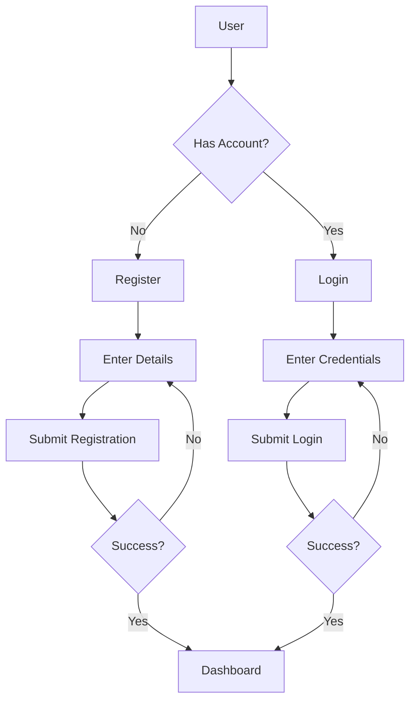

## 2. Book Management Flow
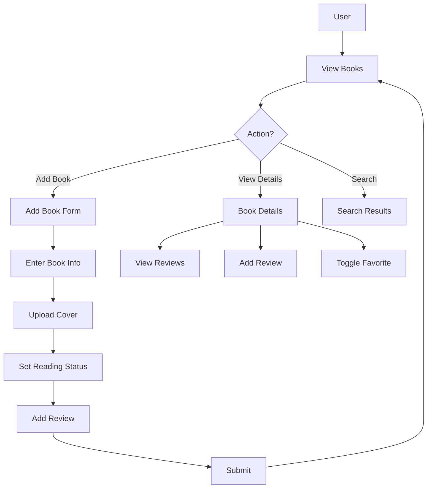

## 3. Review Management Flow
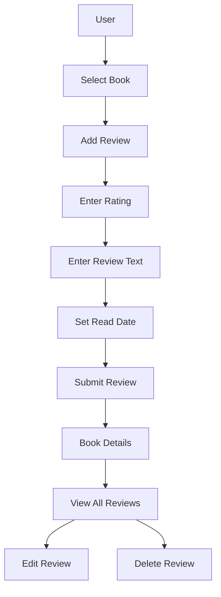

## 4. Reading Progress Flow
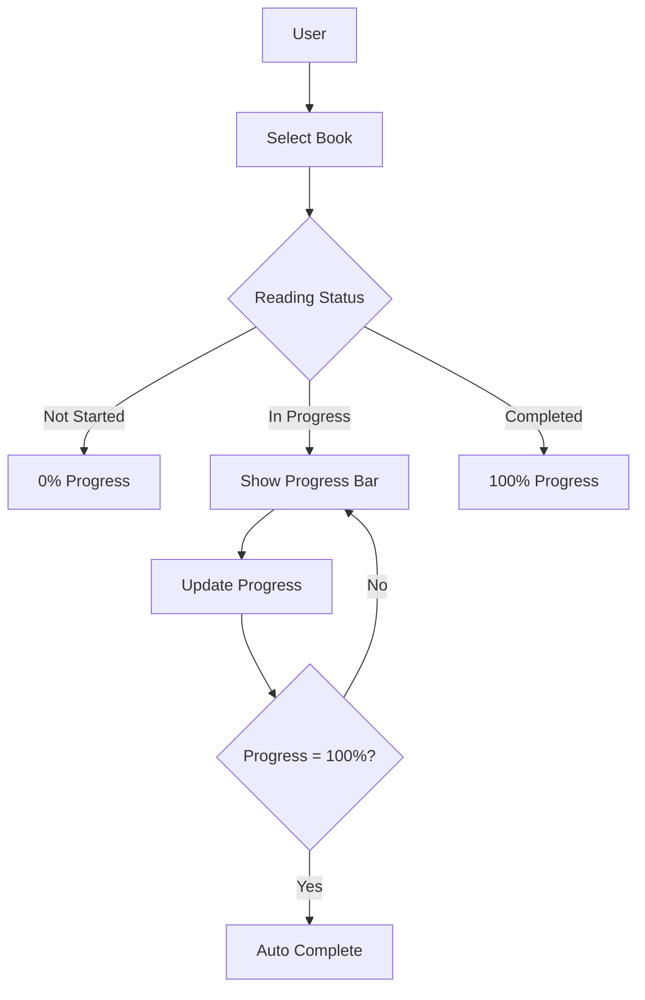

## 5. Favorites Management Flow
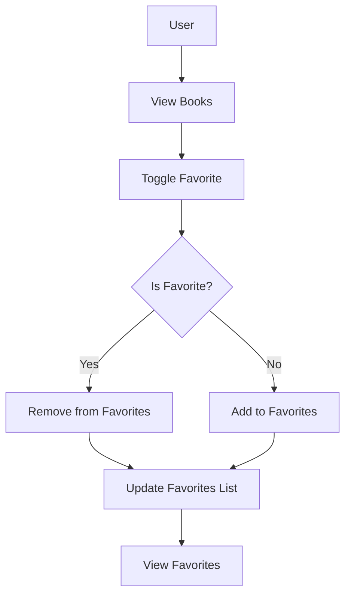

## 6. Application Architecture
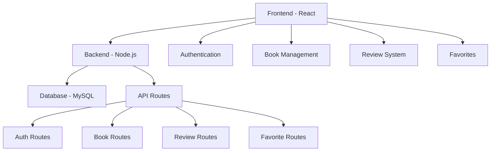

## 7. Data Flow
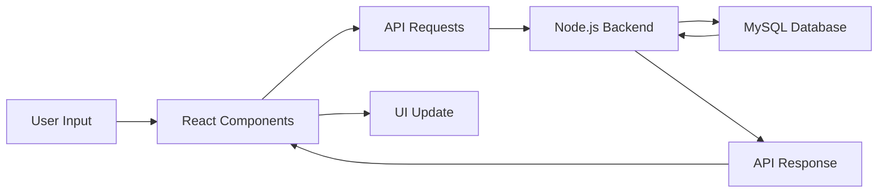

## 8. Component Hierarchy
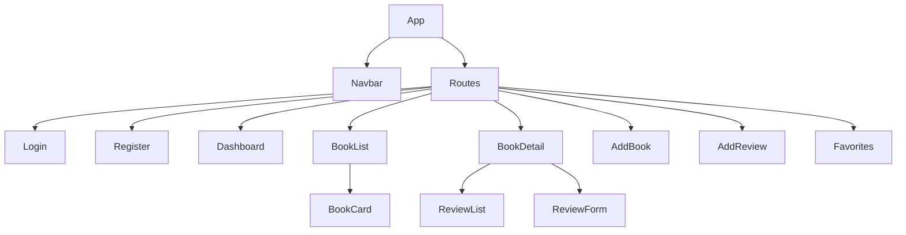

## 9. Authentication State Flow
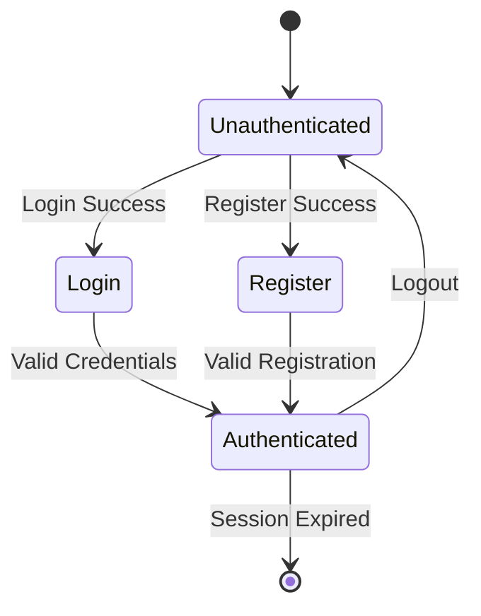

## 10. Error Handling Flow
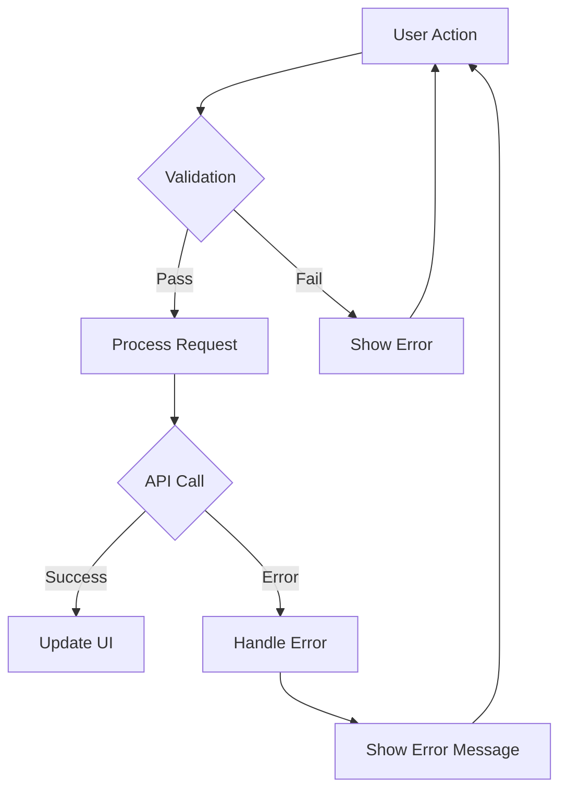

## 11. Database Schema Flow
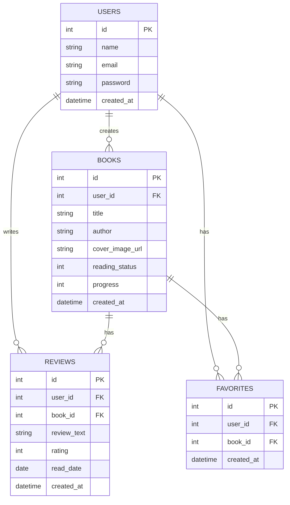

## 12. API Endpoints Flow
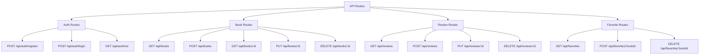

These flow diagrams provide a comprehensive view of the application's functionality and architecture. They cover:
- User authentication and registration
- Book management and review system
- Reading progress tracking
- Favorites management
- Application architecture
- Data flow
- Component hierarchy
- Authentication state management
- Error handling
- Database schema
- API endpoints

Each diagram focuses on a specific aspect of the application, making it easier to understand the different workflows and their interactions.