# Book Tracking and Review Application

A full-stack web application for tracking books, managing reading progress, and sharing reviews. Users can add books, track their reading status, write reviews, and manage their personal book collection.

## Features

### User Features
- User authentication (login/register)
- Add new books with title, description, cover image, authors, and genres
- Track reading status (not started, in progress, completed)
- Track reading progress (0-100%)
- Mark books as owned (physical copy)
- Add/remove books from wishlist
- Write and manage reviews
- Edit/delete books they've added
- Search books by title

### Admin Features
- Manage all books (edit/delete any book)
- Manage authors and genres
- Moderate reviews
- Access admin dashboard

## Architecture

### Flow Diagram

```mermaid
graph TD
    A[User/Admin] --> B[Frontend React App]
    B --> C[Authentication]
    C --> D[Protected Routes]
    D --> E[Backend API]
    E --> F[MySQL Database]
    
    subgraph Frontend
    B --> G[Components]
    G --> H[Dashboard]
    G --> I[Book Details]
    G --> J[Add/Edit Book]
    G --> K[User Profile]
    end
    
    subgraph Backend
    E --> L[Book Routes]
    E --> M[Auth Routes]
    E --> N[User Routes]
    E --> O[Review Routes]
    end
    
    subgraph Database
    F --> P[Books]
    F --> Q[Users]
    F --> R[Reviews]
    F --> S[Authors]
    F --> T[Genres]
    end
```


## Project Structure

### Frontend Structure
```
frontend/
├── public/
│   └── default-book-cover.jpg
├── src/
│   ├── components/
│   │   ├── Login.js
│   │   ├── Register.js
│   │   ├── Navigation.js
│   │   ├── Dashboard.js
│   │   ├── BookDetails.js
│   │   ├── AddBook.js
│   │   ├── EditBook.js
│   │   └── AdminDashboard.js
│   ├── App.js
│   └── index.js
└── package.json
```

### Backend Structure
```
backend/
├── src/
│   ├── models/
│   │   ├── index.js
│   │   ├── user.model.js
│   │   ├── book.model.js
│   │   ├── author.model.js
│   │   ├── genre.model.js
│   │   └── review.model.js
│   ├── routes/
│   │   ├── auth.routes.js
│   │   ├── book.routes.js
│   │   ├── user.routes.js
│   │   └── admin.routes.js
│   ├── middleware/
│   │   └── auth.middleware.js
│   ├── config/
│   │   └── database.js
│   └── server.js
└── package.json
```

## API Routes

### Authentication Routes
- `POST /api/auth/register` - Register new user
- `POST /api/auth/login` - User login
- `POST /api/auth/admin/register` - Register admin (with admin code)

### Book Routes
- `GET /api/books` - Get all books
- `GET /api/books/:id` - Get single book details
- `POST /api/books` - Add new book
- `PUT /api/books/:id` - Update book (admin or creator only)
- `DELETE /api/books/:id` - Delete book (admin or creator only)
- `POST /api/books/:id/status` - Update reading status
- `POST /api/books/:id/reviews` - Add review
- `DELETE /api/books/:id/reviews/:reviewId` - Delete review

### Admin Routes
- `GET /api/admin/users` - Get all users
- `GET /api/admin/stats` - Get application statistics
- `POST /api/admin/authors` - Add new author
- `POST /api/admin/genres` - Add new genre

## Setup Instructions

### Prerequisites
- Node.js (v14 or higher)
- MySQL (v8 or higher)
- npm or yarn

### Backend Setup
1. Navigate to backend directory:
   ```bash
   cd backend
   ```

2. Install dependencies:
   ```bash
   npm install
   ```

3. Create `.env` file:
   ```
   DB_HOST=localhost
   DB_USER=your_db_user
   DB_PASSWORD=your_db_password
   DB_NAME=book_tracker
   JWT_SECRET=your_jwt_secret
   ADMIN_CODE=your_admin_registration_code
   ```

4. Initialize database:
   ```bash
   npx sequelize-cli db:create
   npx sequelize-cli db:migrate
   ```

5. Start the server:
   ```bash
   npm run dev
   ```

### Frontend Setup
1. Navigate to frontend directory:
   ```bash
   cd frontend
   ```

2. Install dependencies:
   ```bash
   npm install
   ```

3. Create `.env` file:
   ```
   REACT_APP_API_URL=http://localhost:5000/api
   ```

4. Start the application:
   ```bash
   npm start
   ```

## Database Schema

### Users Table
- id (PK)
- username
- email
- password (hashed)
- role (user/admin)
- createdAt
- updatedAt

### Books Table
- id (PK)
- title
- description
- coverImage
- createdBy (FK to Users)
- createdAt
- updatedAt

### Authors Table
- id (PK)
- name
- createdAt
- updatedAt

### Genres Table
- id (PK)
- name
- createdAt
- updatedAt

### Reviews Table
- id (PK)
- content
- userId (FK to Users)
- bookId (FK to Books)
- createdAt
- updatedAt

### UserBooks Table
- userId (PK, FK to Users)
- bookId (PK, FK to Books)
- readingStatus
- readingProgress
- hasPhysicalCopy
- isWishlisted
- createdAt
- updatedAt

### BookAuthors Table
- bookId (PK, FK to Books)
- authorId (PK, FK to Authors)

### BookGenres Table
- bookId (PK, FK to Books)
- genreId (PK, FK to Genres)

## Technologies Used

### Frontend
- React
- Material-UI
- Axios
- React Router
- React Toastify

### Backend
- Node.js
- Express.js
- Sequelize ORM
- MySQL
- JSON Web Tokens
- Bcrypt

## Security Features
- JWT-based authentication
- Password hashing
- Protected routes
- Role-based access control
- Input validation
- Error handling
- CORS protection
